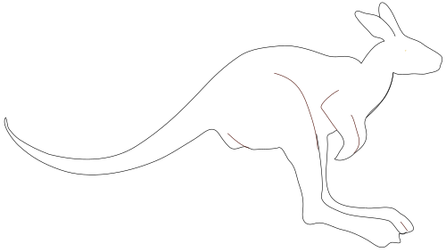

	
	 
	

		

			<h1>
				Awesome Algorithmic Bias Mitigation
			</h1>
		

	

A curated list of resources on bias mitigation research for ML/CV researchers and engineers.

## Presentations and talks

- [The danger of predictive algorithms in criminal justice](https://youtu.be/p-82YeUPQh0) - Dr. Hany Farid talks about how his team reverse engineered the inherent dangers and potential biases of recommendations engines built to mete out justice in today's criminal justice system.
- [Stanford HAI 2019 Fall Conference](https://youtu.be/BS-DoiBxQ48) - Race, Rights and Facial Recognition

## Papers and articles

- [The long road to fairer algorithms](https://www.nature.com/articles/d41586-020-00274-3) - A short article on the benefits of using causal models to identify and mitigate discrimination.
- [Gender Classification and Bias Mitigation in Facial Images](https://arxiv.org/abs/2007.06141) - A paper describing the failure of facial datasets in regards to non-binary gender and introduces a new dataset focused around the complexities of gender assignment. Uses `selection rate` as a measure of bias.
- [Being Bayesian, Even Just a Bit, Fixes Overconfidence in ReLU Networks](https://proceedings.icml.cc/static/paper_files/icml/2020/780-Paper.pdf) - The authors propose a method to model the confidence of the models with respect to the input space.
- [Statistical Equity: A Fairness Classification Objective](https://arxiv.org/pdf/2005.07293.pdf) - Proposes a new fairness definition, motivated by the principle of equity, that considers existing biases in the data and attempts to make equitable decisions that account for these previous historical biases.
- [Face Recognition: Too Bias, or Not Too Bias?](https://arxiv.org/pdf/2002.06483.pdf) - The conventional approach of learning a global threshold for all pairs
results in performance gaps between subgroups. By learning subgroup-specific thresholds, we reduce performance gaps, and also show a notable boost in overall performance.
- [DeBayes: a Bayesian Method for Debiasing Network Embeddings](https://proceedings.icml.cc/static/paper_files/icml/2020/1517-Paper.pdf) -  DeBayes: a
conceptually elegant Bayesian method that is capable of learning debiased embeddings by using a biased prior. Our experiments show that these representations can then be used to perform link prediction that is significantly more fair in terms of popular metrics such as demographic parity and equalized opportunity.
- [Two Simple Ways to Learn Individual Fairness Metrics from Data](https://proceedings.icml.cc/static/paper_files/icml/2020/6161-Paper.pdf) - Individual fairness is an intuitive definition of algorithmic fairness that addresses some of the drawbacks of group fairness. In this paper, we present two simple ways to learn fair metrics from a variety of data types. We show empirically that fair training with the learned metrics leads to improved fairness on three machine learning tasks susceptible to gender and racial biases.
- [Data preprocessing to mitigate bias: A maximum entropy based approach](https://proceedings.icml.cc/static/paper_files/icml/2020/2750-Paper.pdf) - This paper presents an algorithmic framework that can be used as a data preprocessing method towards mitigating bias. Unlike prior work, it can efficiently learn distributions over large domains, controllably adjust the representation rates of protected groups and achieve target fairness metrics such as statistical parity, yet remains close to the empirical distribution induced by the given dataset.
- [Fair Generative Modeling via Weak Supervision](https://proceedings.icml.cc/static/paper_files/icml/2020/5778-Paper.pdf) - We present a weakly supervised algorithm for overcoming dataset bias for deep generative models.
- [SDE-Net: Equipping Deep Neural Networks with Uncertainty Estimates](https://proceedings.icml.cc/static/paper_files/icml/2020/1840-Paper.pdf) - We propose a new method for quantifying uncertainties of DNNs from a dynamical system perspective. The core of our method is to view DNN transformations as state evolution of a stochastic dynamical system and introduce a Brownian motion term for capturing epistemic uncertainty.
- [Conditional Learning of Fair Representations](https://iclr.cc/virtual_2020/poster_Hkekl0NFPr.html) - We propose a novel algorithm for learning fair representations that can simultaneously mitigate two notions of disparity among different demographic subgroups in the classification setting.
- [Exploring Racial Bias within Face Recognition via per-subject Adversarially-Enabled Data Augmentation](https://openaccess.thecvf.com/content_CVPRW_2020/html/w1/Yucer_Exploring_Racial_Bias_Within_Face_Recognition_via_Per-Subject_Adversarially-Enabled_Data_CVPRW_2020_paper.html) - In this study, we propose a novel adversarial derived data augmentation methodology that aims to enable dataset balance at a per-subject level via the use of image-to-image transformation for the transfer of sensitive racial characteristic facial features.
- [Revisiting the Evaluation of Uncertainty Estimation and Its Application to Explore Model Complexity-Uncertainty Trade-Off](https://openaccess.thecvf.com/content_CVPRW_2020/html/w1/Ding_Revisiting_the_Evaluation_of_Uncertainty_Estimation_and_Its_Application_to_CVPRW_2020_paper.html) - In this paper, we focus on the two main use cases of uncertainty estimation, i.e., selective prediction and confidence calibration.
- [Attribute Aware Filter-Drop for Bias Invariant Classification](https://openaccess.thecvf.com/content_CVPRW_2020/html/w1/Nagpal_Attribute_Aware_Filter-Drop_for_Bias_Invariant_Classification_CVPRW_2020_paper.html) - This research proposes a novel Filter-Drop algorithm for learning unbiased representations.

## Workshops and competitions

- [Fair Face Recognition and Analysis](http://chalearnlap.cvc.uab.es/workshop/37/description/) - 2020 ChaLearn Looking at People workshop ECCV
- [Fair Face Recognition challenge](http://chalearnlap.cvc.uab.es/challenge/38/description/) - ECCV 2020
- [FAIR, DATA EFFICIENT AND TRUSTED COMPUTER VISION](https://fadetrcv.github.io/) - IEEE CVPR 2020 WORKSHOP

## Repositories and Code

- [Google Research Label Bias](https://github.com/google-research/google-research/tree/master/label_bias)
- [Face Recognition: Too Bias, or Not Too Bias?](https://github.com/visionjo/facerec-bias-bfw)
